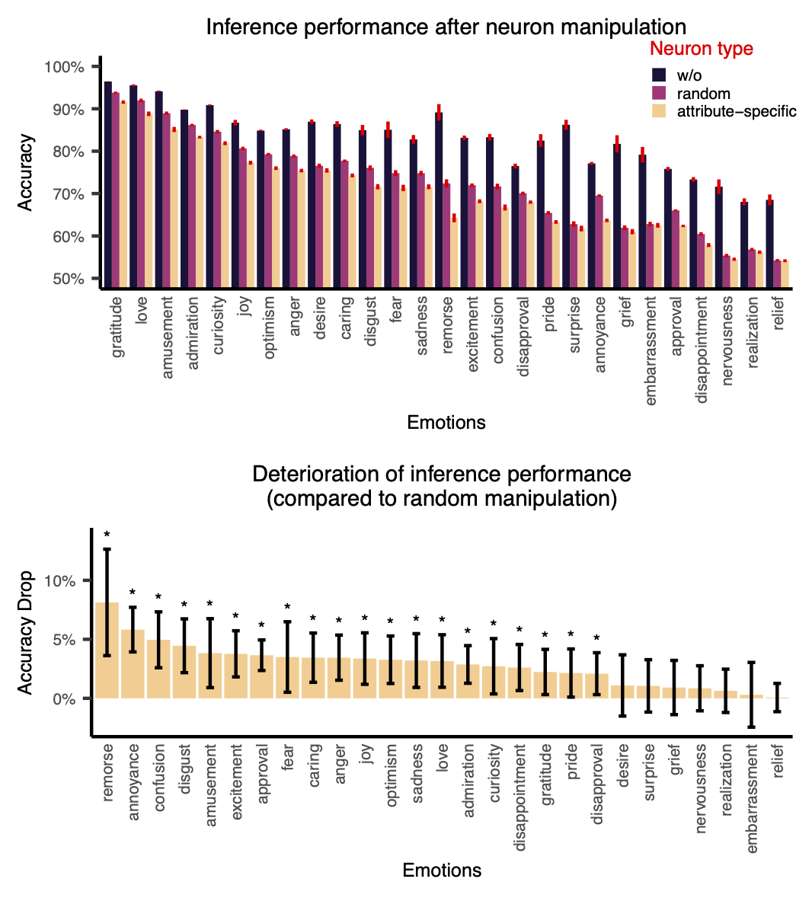

<!--<h1> Model Emotion</h1>-->

<h1> Model Emotion</h1>


<p align="center">
	<a href="#overview">Overview</a> 
    • <a href="#news">News</a> 
    • <a href="#installation">Installation</a> 
    • <a href="#usage">Usage</a> 
    • <a href="#result">Result</a> 
    • <a href="./README-ZH.md" target="_blank">简体中文</a>
</p>


<p align="center">
	
<!--	
<a href='https://bmtrain.readthedocs.io/en/latest/?badge=latest'>

</a>
<a href="https://github.com/OpenBMB/BMTrain/releases">

</a>
<a href="https://github.com/OpenBMB/BMTrain/blob/main/LICENSE">

</a>
-->
	
<a href="https://colab.research.google.com/drive/1VCSIDaX_pgkrSjzouaNH14D8Fo7G9GBz?usp=sharing">

</a>
</p>


<p align="center">

<!---->
</p>

<div id="overview"></div>

## Overview
This is the toolkit to explore the emerging emotion concept in Large-Scale Language Models. Specifically, we can utilize this toolkit to observe the human emotion knowledge representation emerges in large language models and supports discrete emotion inference.

<div id="news"></div>

## News
- 2023.02.15 These codes support you to access RoBERTa to explore the humna-like emotion concepts.
- 2023.02.20 The version2.0 supports you to access any existing pre-trained language models o explore the humna-like emotion concepts.
- 2023.03.30 (Expected) We will provide more user-friendly API to enable non-CS background research to play our codes.

<div id="installation"></div>

## Installation
To set up the environment, run the following code in bash:
```bash
conda create -n openNeuron python=3.8
conda activate openNeuron
pip install -r requirements.txt
```


<div id="usage"></div>

## Usage

Please refer to `Model_Emotion-2.0-latest/train.py` for a full example.

### **Step 1: Arguments**
Before running any experiments, we need to set the correct arguments. We extend the original `transformers.TrainingArguments`. Please refer to `transformers` documentation and `./Model_Emotion-2.0-latest/framework/training_args.py` for the full list of arguments. 
For most arguments, the default values work fine. Here are some important parameters you may want to change.

```
output_dir: Required. Output directory for checkpoint, results, etc. E.g. 'outputs'.
backbone: The PLM to use. E.g. 'roberta-base'.
prompt_len: The number of soft prompt tokens. E.g. 100.
sentiment: The emotion to use. See the below section for more details. E.g. 'surprise'.
max_source_length: The maximum length of input. E.g. 128.
```

An example of using the CLI arguments is shown below
```
--output_dir outupts \
--backbone roberta-base \
--prompt_len 100 \
--sentiment surprise \
--max_source_length 128
```

In Python scripts, you can use the following code to generate the arguments

```python
from framework.training_args import ModelEmotionArguments

args = ModelEmotionArguments()
```

### **Step 2: Train Emotional Prompt**

Before activating neurons in the PLMs, we need emotional prompts to change the attention distribution in the model. 

We use **[GoEmotions](https://doi.org/10.48550/arXiv.2005.00547)** as the prompt training dataset. It is the largest manually annotated dataset of 58k English Reddit comments, labeled for 27 emotion categories or Neutral. It has been proved that it can generalize well to other domains and different emotion taxonomies.

We define **27 Emotional tasks** according to the labels of **GoEmotions**. Each one of the tasks was trained by **12 Random Seeds** (Data used for training will slightly differ when using different random seeds).

You can train prompt for a given emotion by running the following function: 
```python
from transformers import tokenizer
from framework import RobertaForMaskedLMPrompt

tokenizer = AutoTokenizer.from_pretrained(args.backbone, max_length=args.max_source_length, use_fast=False)
model = RobertaForMaskedLMPrompt.from_pretrained(args.backbone, prompt_len=args.prompt_len, num_labels=2)

# Initialize trainer
trainer = ModelEmotionTrainer(
    args=args,
    model=model,
    tokenizer=tokenizer,
    compute_metrics=compute_metrics)

# Train
train_result = trainer.train_prompt()
eval_result = trainer.eval_prompt()
```


### **Step 3: Activate Neurons in Model**

We use the special token '**\<s>**' to activate the neurons in RoBERTa.

The **activated neurons** of the model are the output of the `intermediate` layer between two Feed-Forward Networks. You can get the activated neurons `before` or `after` the activation function `ReLU` by running:
```python
neuron_before_relu, neuron_after_relu = trainer.activated_neuron()
```

### **Step 4: Sort Activated Neurons by RSA Seachlight**

**Methods for Sorting Neurons**

* `14Properties` [ DEFAULT ]

  TODO
* `3Spaces`: Affective Space, Basic Emotions Space, Appraisal Space

  TODO


### **Step 5: Generate Masks Based on the Importance of Neurons**

After getting the neurons sorted out, we will generate masks for the top k important neurons. We will also generate random masks for setting the baseline.

In the `ModelEmotionTrainer.mask_activated_neuron`, we provide several methods for generating random masks and evaluating model's performance with the generated mask. 

**Methods for Masking Neurons**

* `BINARY_MASK` [ DEFAULT ]

  Use 0 to represent the masked neurons, and 1 to represent the unmasked neurons.
* `FLOAT_MASK`

  Use random floats in the half-open interval [0.0, 1.0) to represent the mask neurons

You can get the masks by running the following script:

```python
eval_results, mask = trainer.mask_activated_neuron()
```


<!-- ### **Step 6: Evaluate Masked Neurons**

We evaluate the masked neurons using the modified RoBERTa model loaded with the prompt to do the binary classification task. Each time the forward layer of the intermediate module is called, we multiply the corresponding mask by the layer's output.

You can evaluate  the masks by running the default script `./eval.sh` in bash or :
```bash
python eval_mask_neuron.py \
    --sentiment='joy' \
    --random_seed=1 \
    --maskPath='./masks/RSA_14property_top_500_6000.pkl' \
    --resultPath='./eval_mask_neuron_result/RSA_14property_top_500_6000'
``` -->


<div id="result"></div>

## Result

### Neurons Correspond Selectively to Emotional Attributes


\* For each attribute, show the top 4000 neurons of correspondence.


### Accuracy after Masking Corresponding Neurons

 


<!--
## Community
We welcome everyone to contribute codes following our [contributing guidelines](https://github.com/OpenBMB/BMTrain/blob/master/CONTRIBUTING.md).

You can also find us on other platforms:
- QQ Group: 
- Website: 
- Weibo: 
- Twitter: 
-->

<!--
## License
The package is released under the [Apache 2.0](https://github.com/OpenBMB/BMTrain/blob/master/LICENSE) License.
-->

<!--
## Other Notes

`BMTrain` makes underlying changes to PyTorch, so if your program outputs unexpected results, you can submit information about it in an issue.

[](https://colab.research.google.com/drive/1VCSIDaX_pgkrSjzouaNH14D8Fo7G9GBz?usp=sharing)
-->

## Contact
- [Yusheng Su](https://yushengsu-thu.github.io/): yushengsu.thu@gmail.com; suys19@mauls.tsinghua.edu.cn

- Ming Li: liming16@tsinghua.org.cn

- Xiuyuan Huang: 
